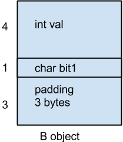
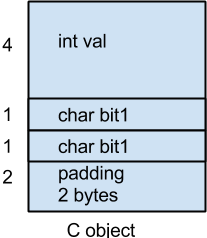
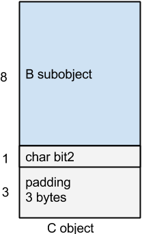
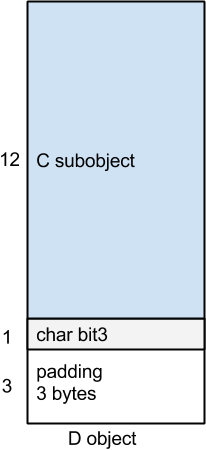
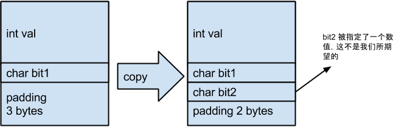

#“继承”与 Data Member
在没有多态的继承中，在一些编译器比如VS中，如果把一个 class 分成两层或者多层，有可能会为了“表现 class 体系之抽象”而膨胀所需要的空间。C++ 语言保证“出现在 devided class 中的 base class subobject 有其完整原样性”。比如如下代码：
	
	class A {
	protected:
		int a;
		char b;
		char c;
		char d;
	};
	
	class B {
	private:
		int a;
		char b;
	};
	
	class C : public B {
	private:
		char c;
	};
	
	class D : public C {
	private:
		char d;
	};
	
在 64 位机中，sizeof(A) 的结果应该是 8，但是 sizeof(D) 的结果呢？

在 g++ 中，sizeof(D) 的结果也是 8，也就是说，通过继承，子类的成员变量可以直接填补到基类的 padding 空间中，其结构如下：

但是就 C++ 标准来说，为了“base class subobject 在 devided class 中的原样性”，三者的内存布局可能会变成这样：

 

这种布局方式可以避免一个问题，假设是前面一种布局方式，那么就有：

	C *pc2;
	B *pc1_1, *pc1_2;
	pc1_1 = pc2; // ok
	*pc1_2 = *pc1_1; // devided class subobject 被覆盖掉，于是其 bit2 member 现在有了一个并非预期的值

也就是如下：

正如图中注释所说，按照我们一般的理解，将子类对象赋值给基类对象，此时的非基类部分，也就是子类的成员变两部分应该变成未定义的，或者说基类对象不应该含有子类的成员变量。但是这个时候基类对象的内存布局里面却出现了子类对象的成员变量的值，这样可能造成难以查找的错误。

注意，上面代码中的 D 的大小在 gcc 编译器中的结果是 8，但是在同位数机器中的 VS 中的结果是 16，也就是说，VS 按照了正常来布局，gcc 可能考虑到内存使用效率等原因，使用的是第一种的布局方法。