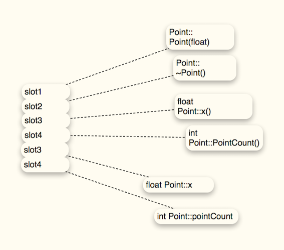

####什么是c++对象模型
*	语言中直接支持面向对象程序设计的部分
*	对于各种支持的底层实现机制

	
		c++对象模型的第一个概念是“不变量”，例如，c++ class的完整 virtual functions 在编译期就固定下来。这使得虚拟调用操作可以快速地派送结果，付出的成本则是执行期的弹性。
		
`一般而言，virtual function calls 是通过一个表格（内含 virtual functions 地址）的索引而决议得知。但是编译器并不一定需要这样做，编译器可以自由引进其他任何变通做法。 但是目前编译器对 virtual function 的实现法都是使用各个 class 的专属 virtual table，大小固定，并在程序执行前就构造好了`

###关于对象

在c语言中，“数据”和“处理数据的操作”是分开来执行的。也就是说，语言本身并没有支持“数据和函数”之间的关联性。比如我们有如下的数据结构：
	
	typedef struct point3d {
		float x;
		float y;
		float z
	} Point3d;
如果要打印这样一个Point3d，可能就需要定义这样一个函数：
	
	void Point3d_print(const Point3d* p) {
		printf("(%f, %f, %f)", p->x, p->y, p->z);
	}
	
或者用宏：
	
	#define Point3d_print(p) \
		printf("(%f, %f, %f)", p->x, p->y, p->z);
		
而在 c++ 中，Point3d 可能采用独立的“抽象数据类型”来实现

	class Point3d {
	public:
		Point3d(float x_ = 0.0, float y_ = 0.0, float z_ = 0.0) :
			x(x_), y(y_), z(z_) { }

		float x() { return x; }
		float y() { return y; }
		float z() { return z; }

		void x(float x_) {x  = x_; }
		...
	private:
		float x, y, z;
	};

	inline ostream&
		operator<< (ostream& os, const Point3d& p) {
			os << '(' << p.x() << ", " << p.y() << ", " << p.z() << ")";
		}
		
或者可以用模板进行参数化。
	
	template <class type, int dim>
	class Point{
	public:
		Point();
		Point(type coords_[ dim ]) {
			for (int i = 0; i != dim; ++i)
				coords[i] = coords_[i];
		}
		type& operator[] (int index) {
			assert(index < dim && index >= 0);
			return coords[index];
		}
		type operator const {
			/* same as none const */
		}
		...
	private:
		type coords[ dim ];
	};
	
	inline
	template <class type, int dim>
	ostream&
	operator<<(ostream& os, const Point<type, dim>& pt) {
		os << '(';
		for (int i = 0; i < dim - 1; ++i)
			os << pt[i] << ", ";
		os << pt[dim - 1] << ')';
	}
	
####加上封装后的成本
首先，class Point3d 并没有增加布局成本，他和 c struct 一样。而 member function 虽然含在 class 声明内，却不出现在 object 中。每一个 non-inline member function 只会诞生一个函数实例。而每一个“拥有零个或一个定义”的inline function 则会在其每一个使用者（模块）身上产生一个函数实例。

`virtual function机制： 用以支持一个有效率的“执行期绑定”`

 `virtual base class 机制： 用以实现“多次出现在继承体系中的 base class，有一个单一而被共享的实例”`

###c++对象模式
在c++中，有两种 class date member: static 和 nonstatic，以及三种 class member functions： static、nonstatic 和 virtual。
####简单对象模型
一个object 是一系列的 slot。每个 slot 指向一个 menbers。menbers 按照其声明顺序，各被指定一个 slot。

 
####表格驱动对象模型
把所有与 members 相关的信息抽取出来，放在一个 data member tabel 和一个 member function tabel 中。class  object 则内含指向这两个表格的指针。member function tabel 是一系列的 slots，每个 slot 指向一个 member function；
data member tabel 则直接持有 data 本身

####C++对象模型
Nonstatic data member 被配置于每一个 class object 之内，static data members 则被存放在个别的 class object 之外。Static 和 nonstatic function member 也被放在个别 class object 之外。virtual 则以下面两个步骤支持：

*	每一个class产生一堆指向 virtual functions 的指针，放在表格之中。这个表格被称为 virtual table(vtbl)
*	每一个 class object 被安插一个指针，指向相关的 virtual table。通常这个指针被称为 vptr。vptr 的设定和重置都由每一个 class 的constructor、destructor 和 copy assignment 运算符自动完成。每一个 class 所关联的 type_info object （用以指出 running time identification，RTTI）也经由 virtual table 被指出来，通常放在表格的第一个 slot。
