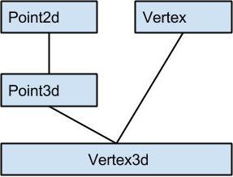
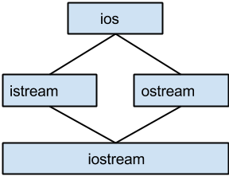
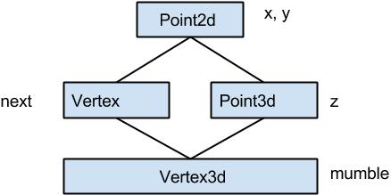

##支持多态的弹性所带来的空间和存取时间上的负担
-	导入一个 virtual table，用来存放它所声明的每一个 virtual function 的地址。这个 table 的元素个数一般而言是被声明的virtual functions 的个数，再加上一个或两个 slots（用于支持 runtime type identification）。
-	在每一个 class object 中导入一个 vptr，提供执行期链接，使每一个 object 能找到相应的 virtual table。
-	加强 constructor，使它能够为 vptr 设定初值，让它指向 class 所对应的 virtual table。这可能意味着在 devided class 和每一个 base class 的 constructor 中，重新设定 vptr 的值。其情况是编译器优化的积极性而定
-	加强 destructor，使它能够抹消“指向 class 之相关 virtual table”的 vptr。要知道，vptr 很可能已经在 derived class destructor 中被设定为 drived class 的virtual table地址。destructor 的调用顺序是相反的，从 derived class 到 base class。

####vptr的位置
-	在早期，在一些编译器中 vptr 被放在class object 的尾端，这样可以保持与 c 语言的兼容性【比如继承一个 struct】
-	到了 c++2.0，开始支持虚拟继承以及抽象基类，并且由于面向对象范式的兴起，某些编译器开始把 vptr 放到class object 的头部，比如 VS和GCC

    
##多重继承
 
单一继承提供了一种“自然多态”形式，是关于 classes 体系中的 base type 和 derived type 之间的转换。在这种情况下，base class 和 derived class 的 object 都是从相同的地址开始，这样在将一个 derived class object 指定给 base clss（不管继承程度有多深）的指针或者 reference，这个操作并不需要编译器去调停或修改地址。它很自然地可以发生，而且提供了最佳效率。

把vptr放在class object 的起始处。如果base class没有 virtual function而derived class有，那么单一继承的自然多态就会被打破。此时的转换就需要编译器的介入。

多重继承不容易塑模出其模型，其复杂度在于 derived class 和其上一个 base class 乃至上上一个baseclass.....之间的“非自然”关系，比如如下的继承图：

&nbsp;&nbsp;&nbsp;&nbsp;&nbsp;&nbsp;&nbsp;&nbsp;&nbsp;&nbsp;&nbsp;&nbsp;&nbsp;&nbsp;&nbsp;&nbsp;&nbsp;&nbsp;&nbsp;&nbsp;&nbsp;&nbsp;&nbsp;&nbsp;&nbsp;&nbsp;&nbsp;&nbsp;&nbsp;&nbsp;&nbsp;&nbsp;&nbsp;&nbsp;&nbsp;&nbsp;&nbsp;&nbsp;&nbsp;&nbsp;&nbsp;&nbsp;&nbsp;&nbsp;&nbsp;&nbsp;&nbsp;&nbsp;&nbsp;&nbsp;&nbsp;&nbsp;&nbsp;

那么比如如下转换：

	extern void mumble(const Vertex&);
	Vertex3d v;
	mumble(v);

就不是自然转换。

对一个多重派生对象，将其地址指定给“最左端(也就是第一个) base class的指针”，情况将和单一继承时相同，因为二者都指向相同的起始地址。需付出的成本只有地址的指定操作而已。至于第二或后继的 base class的地址指定操作，则需要将地址修改：加上（或减去，如果 downcast 的话）介于中间的 base class subobject大小。比如：

	Vertex3d v3d;
	Vertex *pv;
	Point2d *p2d;
	Point3d *p3d;

那么下面这个指定操作：

	pv = &v3d;

需要这样的内部转化：

	pv = (Vertex*)(((char*)&v3d) + sizeof(Point3d));

而下面的指定操作：

	p2d = &v3d;
	p3d = &v3d;

只需要简单的拷贝其地址就好
如果有两个指针如下：

	Vertex3d *pv3d;
	Vertex *pv;

那么下面的指定操作：
	
	pv = pv3d;

不能够只是简单地转换为：
	
	pv = (Vertex*)((char*)pv3d + sizeof(Point3d));

因为如果 pv3d 为 0，pv 将获得 sizeof(Point3d) 的值，这是错误的，所以这里需要一个条件测试：

	pv = pv3d
		 ? (Vertex*)((char*)pv3d + sizeof(Point3d))
		 : 0;
而前面那个 reference 不需要进行这样的判断是因为 reference 不可能绑定空。

###虚拟继承
典型的虚拟继承的例子就是iostream library：

&nbsp;&nbsp;&nbsp;&nbsp;&nbsp;&nbsp;&nbsp;&nbsp;&nbsp;&nbsp;&nbsp;&nbsp;&nbsp;&nbsp;&nbsp;&nbsp;&nbsp;&nbsp;&nbsp;&nbsp;&nbsp;&nbsp;&nbsp;&nbsp;&nbsp;&nbsp;&nbsp;&nbsp;&nbsp;&nbsp;&nbsp;&nbsp;&nbsp;&nbsp;&nbsp;&nbsp;&nbsp;&nbsp;&nbsp;&nbsp;&nbsp;&nbsp;&nbsp;&nbsp;&nbsp;&nbsp;&nbsp;
 
代码如下：

	class ios { ... };
	class istream : public virtual ios { ... };
	class ostream : public virtual ios { ... };
	class iostream : public istream, public ostream { ... };
	
这里主要的难度就是，找到一个足够有效的方法，将 istream 和 ostream 各自维护的一个 ios subobject，折叠成为一个由 iostream 维护的单一 ios subobject，并且还可以保存 base class 和 derived class 的指针（以及 reference）之间的多态指定操作。

一般实现方法如下，Class如果内含一个或多个 virtual base class subobject，将被分割为两个部分：一个不变区域和一个共享区域。不变区域中的数据，不管后继如何衍化，总是拥有固定的offset（从object的开头算起），所以这部分可以被直接存取。至于共享区域，所表现的就是virtual base class subobject。这一部分的数据，其位置会因为每次的派生操作而有变化，所以它们只能被间接存取。各编译器实现技术之间的差异就在于间接存取的方法不同。

比如如下继承图：

&nbsp;&nbsp;&nbsp;&nbsp;&nbsp;&nbsp;&nbsp;&nbsp;&nbsp;&nbsp;&nbsp;&nbsp;&nbsp;&nbsp;&nbsp;&nbsp;&nbsp;&nbsp;&nbsp;&nbsp;&nbsp;&nbsp;&nbsp;&nbsp;&nbsp;&nbsp;&nbsp;&nbsp;&nbsp;&nbsp;&nbsp;&nbsp;&nbsp;&nbsp;&nbsp;&nbsp;&nbsp;&nbsp;&nbsp;&nbsp;&nbsp;&nbsp;&nbsp;&nbsp;&nbsp;&nbsp;&nbsp; 

一般布局策略是先安排好 derived class 的不变部分，然后再建立共享部分

存取class的共享部分的一个可能方法：在每个 derived classobject 中安插一些指针，每个指针指向一个 virtual base class。要存取继承的来的 virtual base class members，可以通过相关指针间接完成。比如这样的代码：

	void Point3d::operator+=(const Point3d& rhs) {
		x += rhs.x;
		y += rhs.y;
		z += rhs.z;
	}

在上面的策略下，会被转换为：

	__vbcPoint2d->x += rhs.__vbcPoint2d->x;
	__vbcPoint2d->y ++ rhs.__vbcPoint2d->y;
	z += rhs.z;
	
当然，这样的模型会有如下两个缺点：

-	对每一个对象必须针对其每一个 virtual base class 背负一个额外的指针
-	由于虚拟继承串链的加长，导致间接存取层次的增加

对于第二个问题，一种解决办法是经由拷贝操作取得所有的 nested virtual base class 指针，放到 devided class object 之中。以空间代价换取“固定存取时间”

至于第一个问题，一般而言有两个解决办法：

-	引入 virtual base class table，每个 class object 如果有一个或多个 virtual base classes，就会由编译器安插一个指针，指向 virtual base class table。至于真正的 virtual base class 指针，则是被放在该表格中。【microsoft编译器】
-	在 virtual function table 中放置 virtual base class 的 offset(而不是地址)，将 virtual base class offset 和 virtual function entries 混杂在一起，在某些编译器中，virtual function table 可经由正值或负值来索引。如果是正值，则是索引到 virtual functions；如果是负值，则是索引到virtual base class offsets。【GCC】
    

		#include <iostream>
		
		using namespace std;
		
		class A {
		};
		
		class M {
		
		};
		
		class C : virtual public A, virtual public M { };
		
		class B : virtual public A, virtual public M { };
		
		class D : public C, public B {
		public:
			//virtual void fun() {}
		};
		
		int main(int argc, char const *argv[])
		{
			cout << sizeof(D) << endl;
			return 0;
		}
> 对于如上代码，经测试是如下的结果： 
> 不管注释行是否取消，输出值都是 16，8，  注意这里 16 的来源，对于虚继承，大小变化和父类个数和出现次数无关，`也就是共享部分不会叠加`，但是一般的继承中，比如非共享部分，就会叠加。  
> 而在 vs2102 下，当注释D的fun函数行时，输出结果是 12，4，取消注释时是 16， 4  
> 可以看出，GCC用的正是第二种方法，只要有 virtual base class 或者 virtual function 都会生成一个 vptr 指针，其他的都在 vtbl 完成。 
> 但是 vs2012 似乎用的并不是上面说的第一种方法，如下的代码的结果为：16 4

		class A {
		};
		
		class M {
		
		};
		
		class C : virtual public A, virtual public M { };
		
		class B : virtual public A, virtual public M { };
		class K : virtual public A, virtual public M { };
		
		class D : public C, public B, public K {
		public:
			//virtual void fun() {}
		};
		
		int main(int argc, char const *argv[])
		{
			cout << sizeof(D) << endl;
			cout << sizeof(int*) << endl;
			return 0;
		}
		
>也就是说，随着 virtual base class 的增加，derived class 的大小随之增加，这更像是原始的方法，也就是通过对每个 base class 增加一个指针来完成。

根据第二种情况，可能在编译器会转换为如下代码：

	(this + __vptr__Point3d[-1])->x += (&rhs + rhs.__vptr__Point3d[-1])->x;
	(this + __vptr__Point3d[-1])->y += (&rhs + rhs.__vptr__Point3d[-1])->y;
	z += rhs.z;
	
当然，这种操作会造成存取成本的增加。

