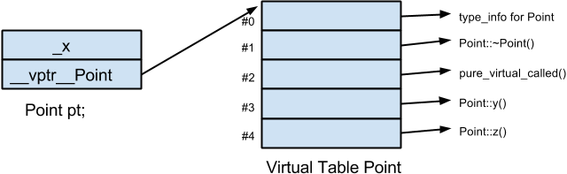
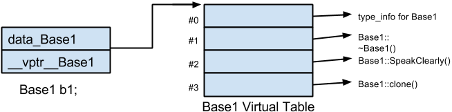
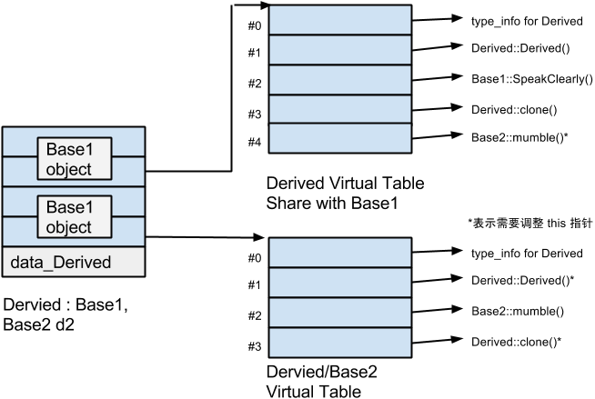
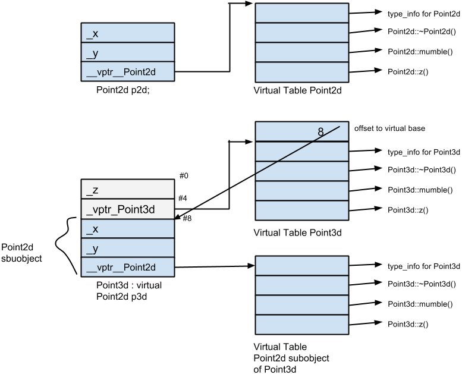

#虚拟成员函数
##单继承

	ptr->z();
	
需要在执行期正确调用需要的成员函数，我们需要知道:
	
-	ptr 所指对象的实际类型。这可使我们选择正确的 z() 实例
-	z() 实例的位置，以便我们能够调用它

那么在实现中，我们就要做如下两点：

-	一个字符串或数字，表示 class 类型
-	一个指针，指向某表格，表格中持有程序的 virtual functions 的执行期地址

那么在执行期备好了函数地址，还需要做的是：

-	为了找到表格，每一个 class object 被安插了一个由编译器内部产生的指针，指向该表格
-	为了找到函数地址，每一个 virtual function 被指派一个表格索引值

`这些工作都由编译器完成，执行期要做的只是在特定的 virtual table slot（记录着 virtual function 的地址）中激活 virtual function`

一个 class 只会有一个 virtual table。每一个 table 内含其对应之 class object 中所有 active virtual function 函数实例的地址。这些 active virtual function 包括：

-	这一 class 所定义的函数实例。它会改写(overriding)一个可能存在的 base class virtual function 函数实例
-	继承自 base class 的函数实例。这是在 derived class 决定不改写 virtual function 时才会出现的情况
-	一个 <i>`pure_virtual_called()`</i> 函数实例，它既可以扮演 pure virtual function 的空间保卫者角色，也可以当做执行期异常处理函数（有时候会用到）

对于如下代码：

	class Point
	{
	public:
		virtual ~Point();
		virtual Point& mult( float ) = 0;

		float x() const { return _x; }
		virtual float y() const { return 0; }
		virtual float z() const { return 0; }

	protected:
		Point( float x = 0.0 );
		float _x;
	};
	
其 class object 的内存布局为：

对于一个 derived class 来说，一共有三种可能性：

-	它可以继承 base class 所声明的 virtual function 的函数实例。正确地说是，该函数实例的地址会被拷贝到 derived class 的 virtual table 的相应 slot 中
-	它可以使用自己的函数实例。这表示它自己的函数实例地址必须放在对应的 slot 中
-	它可以加入一个新的 virtual function。这时候 virtual table 的尺寸会增大一个 slot，而新的函数实例地址会被放在该 slot 中

##多继承
在多继承中支持 virtual functions，其复杂度主要由第二个及后继的 base classes 身上。以及“必须在执行期调整 this 指针”这一点。比如如下的继承体系：

	class Base1
	{
	public:
		Base1();
		virtual ~Base1();
		virtual void speakClearly();
		virtual Base1* clone() const;

	protected:
		float data_Base1;
	};

	class Base2
	{
	public:
		Base2();
		virtual ~Base2();
		virtual void mumble();
		virtual Base2* clone() const;

	protected:
		float data_Base2;
	};

	class Derived : public Base1, public Base2
	{
	public:
		Derived();
		virtual ~Derived();
		virtual Derived *clone() const;

	protected:
		float data_Derived;
	};

对于如上的继承体系，会有三个问题：

-	virtual destruct
-	被继承下来的 Base::mumble()
-	一组 clone() 函数实例

如果我们有如下操作：

	Base2 *pbase2 = new Derived();
	
那么在编译器时期就会产生如下代码：

	Derived *temp = new Derived();
	Base2 *pbase2 = temp ? temp + sizeof(Base1) : 0;
	
如果没有这样的调整，那么指针的任何“非多态调用”都将失败：

	pbase2->dataBase2;
	
这个很容易想明白，因为如果没有调整，那么指针的起始位置并不是 Base2 部分的起始，就没办法根据成员大小来调用。

另外在要删除 pbase2 时：

	delete pbase2;
一般也是需要对指针进行调整，使其重新指向完整对象的起始点的。

注意，这些 this 指针的调整必须在执行期完成。那么，offset 的大小，以及把 offset 加到 this 指针上头的那段程序代码，必须由编译器在某个地方插入。那么在哪个地方插入呢？

#####Thunk
Thunk 是一小段 assembly 代码，用来 <b>(1)</b> 以适当的 offset 值调整指针，<b>(2)</b> 跳到 virtual function 去。
那么由 Base2 指针调用 Derived destructor，其相关的 thunk 可能如下：

	pbase2_dtor_thunk:
		this += sizeof(Base1);
		Derived::~Derived(this);
		
Thunk 技术允许 virtual table slot 继续内含一个简单的指针，因此多重继承不需要任何空间上的额外负担。 Slots 中的地址可以直接指向 virtual function，也可以指向一个相关的 trunk。

由于<b>(1)</b>经由 derived class(或第一个 base class 调用)，<b>(2)</b>经由第二个(或其后继)base class 调用，同一函数在 virtual table 中可能需要多笔对应的 slots。比如如下代码：

	Base1 *pbase1 = new Derived();
	Base2 *pbase2 = new Derived();
	
	delete pbase1;
	delete pbase2;
	
虽然两个 _delete_ 操作导致相同的 Derived destructor，但他们需要两个不同的 virtual table slots：

-	pbase1 不需要调整 this 指针(因为 Base1 是最左端 base class 之故，它已经指向 Derived 对象的起始处)。其 virtual table slot 需放置真正的 destructor 地址
-	pbase2 需要调整 this 指针。其 virtual table slot 需要相关的 thunk 地址

在多重继承之下，一个 derived class 内含 n-1 个额外的 virtual tables。n 表示其上一层的 base class 的个数(因此，单一继承将不会有额外的 virtual table)。对于本例而言，会有两个 virtual tables 被编译器产生出来：

-	一个主要实例，与 Base1 共享
-	一个次要实例，与 Base2 有关

针对每一个 virtual table，Derived 对象中又对应的 vptr，vptr将在 constructor中被设定初值。如下图：

那么，前面的很多 offset 问题就可以解决了，包括在《支持多态class object的内存布局》里面是说的 class D 的大小问题，都可以解决了。

有前面情况引出了下面一种新的情况：
通过一个“指向 derived class” 的指针，调用第二个 base class 中一个继承而来的 virtual function。在这种情况下，derived class 指针必须再次调整，以指向第二个 base subject。

第三种情况是：允许一个 virtual function 返回值有所变化，可能是 base type，也可能是 public derived type。比如 Derived::clone() 函数实例。当我们通过“指向第二个 base class”的指针来调用 clone() 时，this指针的 offset问题出现了：

	Base2 *pb1 = new Derived();
	// 调用 Derive* Derived::clone();
	// 返回值必须被调整，以指向 Base2 subobject
	Base2 *pb2 = pb1->clone();
>当进行 _pb1->clone()_ 时，pb1会被调整指向 Derived 对象的起始地址，于是 clone() 的Derived版会被调用；它会传回一个指针，指向一个新的 Derived 对象；该对象的地址在被指定给pb2前，必须先经过调整，以指向Base2 subobject

###虚拟继承下的 Virtual Functions

	class Point2d
	{
	public:
		Point2d(float = 0.0, float = 0.0);
		virtual ~Point2d();

		virtual void mumble();
		virtual void z();
		// ...
	protected:
		float _x, _y;
	};

	class Point3d : public virtual Point2d
	{
	public:
		Point3d(float = 0.0, float = 0.0, float = 0.0);
		~Point3d();

		float z();
	protected:
		float z;
	};
	
虽然 Point3d 有唯一的 base class，也就是 Point2d，但 Point3d 和 Point2d 的起始部分并不像“非虚拟的单一继承”情况那样一致，其布局图如下：

>在GCC下，Point3d的内存布局里面第一个是 vptr，第二个是_z，符合。

但是上图有一个问题是，个人认为 Point2d subobject 的virtual function 应该是 point2d::mumble()